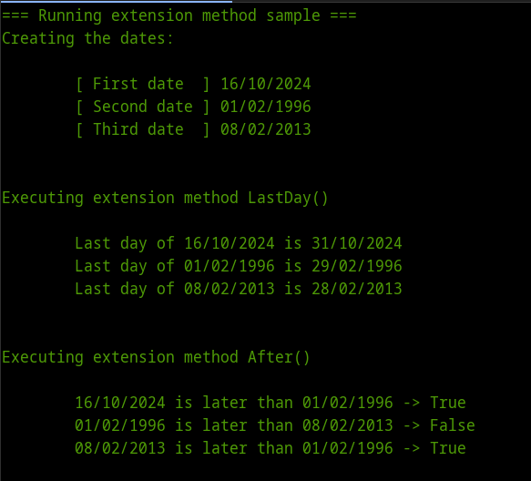
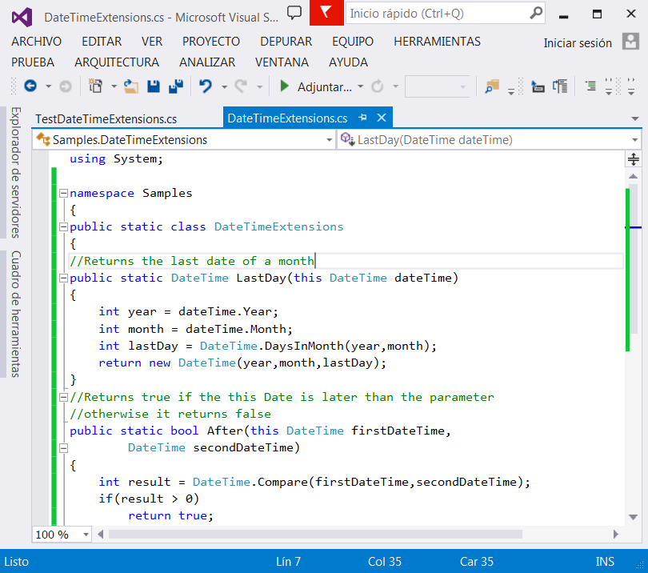

# Utilizando Extension Methods en .NET con C#
		

En programación orientada a objetos, la herencia es uno de los mecanismos más eficientes para extender la funcionalidad de los objetos que componen un sistema, este mecanismo permite que un objeto herede atributos y comportamientos de otro objeto reduciendo así la cantidad de código que tendrá que mantenerse una vez desarrollado el sistema.

Sin embargo agregar funcionalidad a un objeto que no fue diseñado para ser heredado puede ser una tarea no muy recomendable, ya que implica cambiar el diseño de ese objeto y entonces afectar todos los objetos que dependan de él y sus operaciones que lleven a cabo dentro del sistema.

En .NET existe una característica llamada <a href="http://msdn.microsoft.com/en-us//library/bb383977.aspx">extension methods (métodos de extension)</a> que permite agregar funcionalidad (métodos) a un objeto o tipo ya existente en el framework o en los ensamblados sin la necesidad  de crear subclases, recompilar o modificar el código fuente. Esta técnica incluso permite agregar métodos a objetos que provengan de clases selladas (sealed) sin violar el principio de encapsulamiento.

Como ejemplo de esta técnica, agregaré un par de métodos a un tipo incorporado dentro del framework .NET, utilizaré la estructura <a href="http://msdn.microsoft.com/en-us/library/system.datetime.aspx">DateTime</a> que representa el tiempo (fecha y la hora).

A esta estructura voy a agregarle dos métodos uno llamado <b>LastDay</b> que regresa el último día del mes de un objeto DateTime y otro método llamado After que regresa true si el objeto DateTime que lo invoca es mayor a la fecha que recibe como parámetro.

Al ejecutar el programa se ve la siguiente salida.

 
<h2>Propiedades de los extension methods</h2>

Pueden aplicarse a cualquiera de los siguientes objetos: Clases, Estructuras, Interfaces, Delegados, Genéricos y arreglos.
Deben ser declarados dentro de una clase estática, y tener la palabra reservada this antes de su primer parámetro, que es el tipo que el método extiende, los demás parámetros son los argumentos del método.
Son públicos por que se llaman desde fuera de la clase donde ellos son declarados.
Pueden aplicarse en clases selladas (sealed) y tipos intrínsecos porque automáticamente soportan <b>boxing</b> y <b>unboxing</b>, es decir cuando se aplican a un tipo por valor .NET los envuelve como si se tratara de una objeto por referencia.

